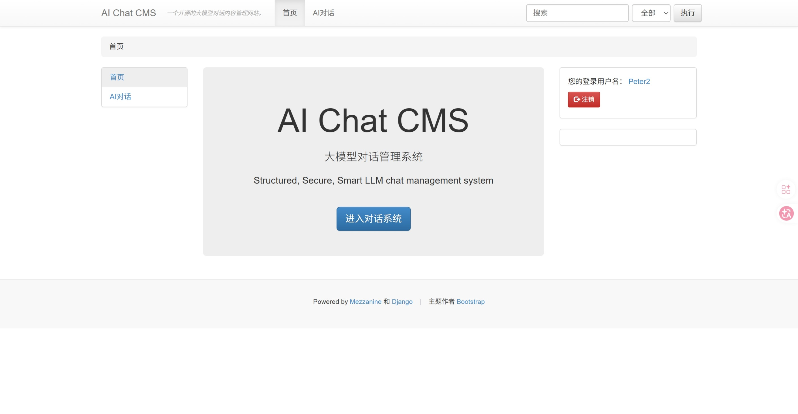
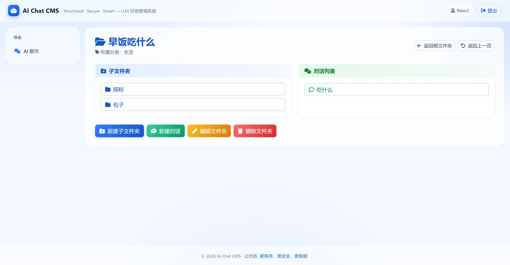
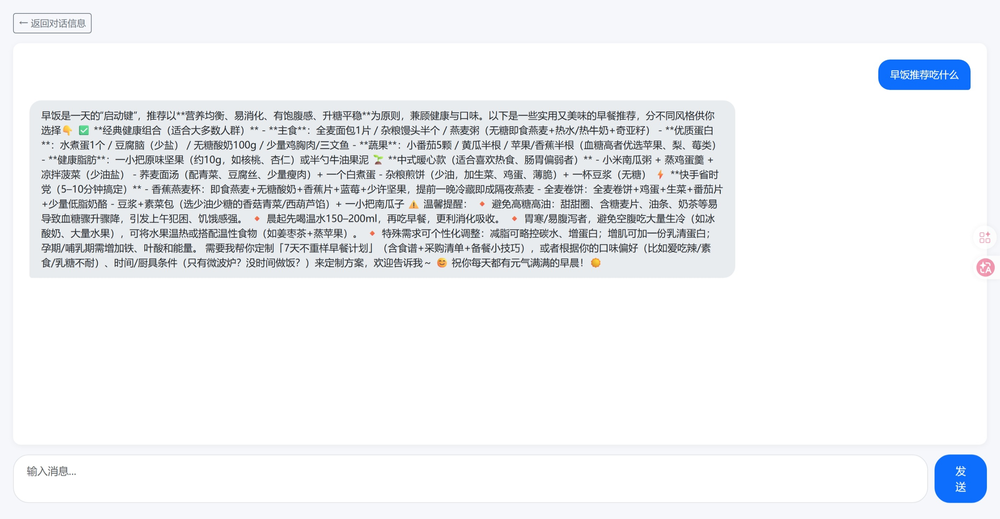

# 人工智能大模型对话管理系统

结构化、安全且智能的大语言模型（LLM）聊天管理系统

---

## 简介

**人工智能大语言模型对话管理系统** 是一款基于django框架，使用mezzanine的web应用，核心功能为实时大模型交互、对话分类分层管理和隐私对话加密，可为个人用户整理聊天内容和企业进行AI工作对话管理提供帮助。

---

## 核心功能

- **结构化聊天记录**：整理对话内容，便于追踪和检索。一级目录为分类category，其余目录为文件夹folder。支持文件夹多层嵌套。文件夹内可同时存储子文件夹和ai对话入口。支持文件夹的移动、重命名和删除，分类的重命名和删除。创建或进入对话后会显示信息栏，用户可随时调整temperature,top_p等参数，为对话撰写简介，更改对话的隐私状态，查看对话的创建和更新时间。
- **安全通信**：采用完善的安全措施保护用户数据和聊天日志。隐私对话使用特设的隐私密码进行保护。隐私密码采用哈希加密方案存储于数据库。api密钥采用fernet加密方案，密钥为django内设SECRET_KEY，有效阻止密码和api密钥泄露。
- **智能集成**：轻松连接并管理不同的大语言模型后端，支持流式对话。（目前仅支持千问大语言模型。采用openai sdk接入api，使用者可自行修改代码实现其他模型对话。）
- **用户管理**：基于角色的访问权限、身份验证以及用户行为追踪。（部分功能仍在开发中，未来将支持不同账号聊天信息的共享，评论）
- **Web界面**：使用HTML和JavaScript构建的直观仪表盘，用于聊天管理。

<br>
界面预览:  

   
   
   

   
   
---

## 技术栈

- **Python** (70.3%) – 后端核心开发语言
- **Django** - 后端框架（未来将使用DRF）
- **Mezzanine** - 提供用户管理、导航栏功能（未来将用于添加博客app）
- **HTML** (27%) – 网页渲染
- **JavaScript** (2.7%) – 前端交互与增强，主要用于对话界面
- **Bootstrap5** - 前端主要使用的库，适配mezzanine
- **SQLite** - 数据库
尚未完成云服务器部署配置，预计使用Docker引擎

---

## 下载

1. **克隆仓库:**
   ```bash
   git clone https://github.com/Peterqi2007/ai_chat_management_system.git
   cd ai_chat_management_system
   ```

2. **创建并激活虚拟环境:**
   ```bash
   python3 -m venv venv
   source venv/bin/activate  # On Windows: venv\Scripts\activate
   ```

3. **下载依赖项:**
   ```bash
   pip install -r requirements.txt
   ```

4. **创建虚拟环境变量**
   - 设置DEBUG,SECRET_KET,DATABASES等变量

5. **执行数据库迁移**
   ```bash
   cd ai_secure_chat
   python manage.py makemigrations
   python manage.py migrate
   ```

6. **运行应用:**
   ```bash
   python manage.py runserver
   ```
   > 网站默认在 `http://localhost:8000` 上运行.

---

## 使用

- 在 [http://localhost:8000](http://localhost:8000) 上进入网站.
- 在 [http://localhost:8000/admin/](http://localhost:8000/admin/)上管理网站模型设置和用户（先注册网站管理员）
- 自定义分类、文件夹和对话

---

## 贡献指南

欢迎提交拉取请求！对于重大变更，请先提交 Issue 讨论你想要修改的内容。

1. 复刻（Fork）本仓库。
2. 创建功能分支：`git checkout -b feature/YourFeature`
3. 提交变更：`git commit -am 'Add your feature'`
4. 推送到分支：`git push origin feature/YourFeature`
5. 打开拉取请求。

---

## 许可证

[MIT 许可证](LICENSE)

---

## 联系方式
有任何技术交流联系 [Peterqi2007](https://github.com/Peterqi2007).


# AI Chat Management System

Structured, Secure, and Smart LLM Chat Management System

---

## Overview

**AI Chat Management System** is a powerful, structured, and secure platform designed to manage Large Language Model (LLM) chats efficiently and intelligently. It provides tools and interfaces for handling chat history, user management, security, and integration with language models, enabling seamless interaction and robust control for enterprise or individual use.

---

## Features

- **Structured Chat History:** Organize conversations for easy tracking and retrieval.
- **Secure Communication:** Robust security measures to protect user data and chat logs.
- **Smart Integrations:** Easily connect and manage different LLM backends.
- **User Management:** Role-based access, authentication, and user activity tracking.
- **Web Interface:** Intuitive dashboard built with HTML and JavaScript for chat management.

---

## Tech Stack

- **Python** (70.3%) – Core logic and API backend
- **HTML** (27%) – Web interface
- **JavaScript** (2.7%) – Frontend interactivity and enhancements

---

## Installation

1. **Clone the repository:**
   ```bash
   git clone https://github.com/Peterqi2007/ai_chat_management_system.git
   cd ai_chat_management_system
   ```

2. **Create and activate a virtual environment (optional but recommended):**
   ```bash
   python3 -m venv venv
   source venv/bin/activate  # On Windows: venv\Scripts\activate
   ```

3. **Install dependencies:**
   ```bash
   pip install -r requirements.txt
   ```

4. **Set up environment variables:**
   - Copy `.env.example` to `.env` and modify as necessary.

5. **Run the application:**
   ```bash
   python manage.py runserver
   ```
   > The server will start on `http://localhost:8000` by default.

---

## Usage

- Access the web interface at [http://localhost:8000](http://localhost:8000).
- Configure chat models and manage users via the dashboard.
- Review, export, or clear chat histories as needed.

---

## Contributing

Pull requests are welcome! For major changes, please open an issue first to discuss what you would like to change.

1. Fork the repository.
2. Create your feature branch: `git checkout -b feature/YourFeature`
3. Commit your changes: `git commit -am 'Add your feature'`
4. Push to the branch: `git push origin feature/YourFeature`
5. Open a pull request.

---

## License

[MIT License](LICENSE)

---

## Contact

For support or business inquiries, please contact [Peterqi2007](https://github.com/Peterqi2007).
